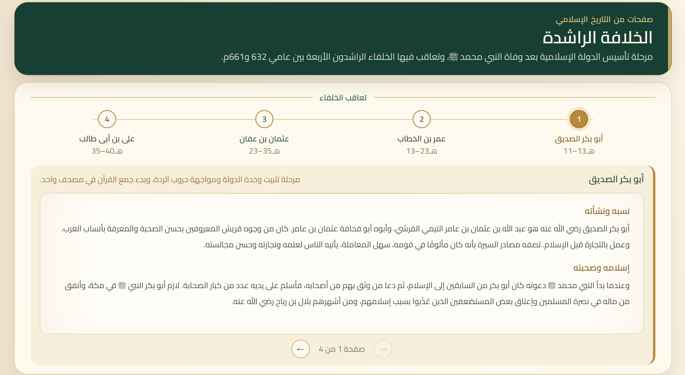
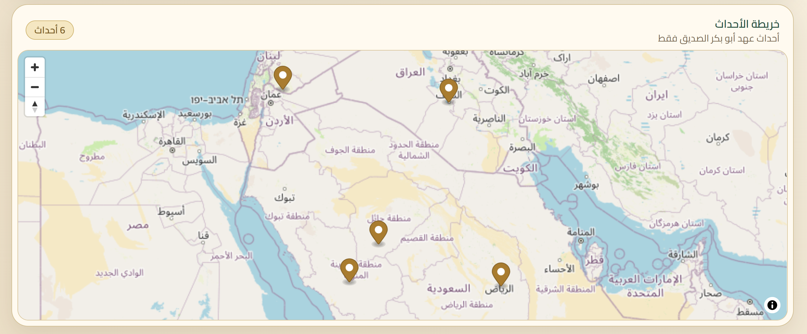

# Islamic History

An interactive Arabic platform for exploring Islamic history through timelines, biographies, historical events, and maps.




The project presents Islamic history as a connected experience. Users can move through historical periods, select important figures, read their biographies, and explore the major events of their time on an interactive map.

The current version focuses on the **Rashidun Caliphate**.

## Features

- Interactive timeline of historical periods and figures
- Detailed Arabic biographies
- Interactive map of historical events and locations
- Events linked to their period, location, and historical context
- Hijri-based chronology
- Historical sources connected to biographies and events

## Tech Stack

**Next.js · React · TypeScript · Tailwind CSS · Supabase · PostgreSQL · MapLibre GL JS · OpenStreetMap**

## Getting Started

Install the dependencies:

```bash
npm install
```

Create a `.env.local` file with your Supabase credentials:

```env
NEXT_PUBLIC_SUPABASE_URL=your_supabase_project_url
NEXT_PUBLIC_SUPABASE_ANON_KEY=your_supabase_anon_key
```

Run the development server:

```bash
npm run dev
```

Then open `http://localhost:3000`.

> The project uses Supabase for its database. Database migrations and historical content import scripts are available under `supabase/`.

## Roadmap

- Complete the Rashidun Caliphate
- Add more eras of Islamic history
- Expand biographies, events, and historical locations
- Add historical territorial changes to the map
- Improve source exploration and historical references
- Continue improving the interactive reading and map experience

## Project Status

🚧 **In active development**

The project currently focuses on building the Rashidun Caliphate experience and its historical dataset. More periods and features will be added as development continues.
