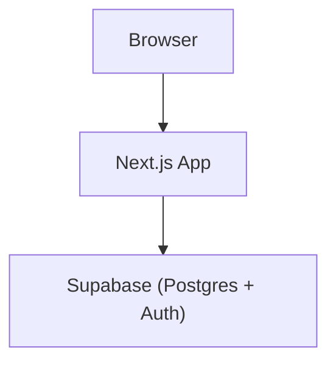

# Architecture

| Box name | Its one job | What it must never become |
| --- | --- | --- |
| Browser | Displays the interface and handles user interaction. | A trusted backend or permanent data store. |
| Next.js App | Renders pages and talks to Supabase. | Its own user table or session store; Supabase Auth owns that. |
| Supabase (Postgres + Auth) | Stores application data and owns authentication. | A place for presentation or browser UI logic. |
