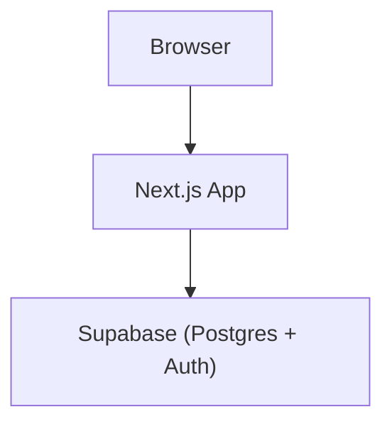

# ملخص حالة مشروع منصة التاريخ الإسلامي

> هذا الملف مخصص لتسليم سياق المشروع إلى ChatGPT أو أي مطور جديد. آخر تحديث: 26 سبتمبر 2026.

## 1. فكرة المشروع الحالية

المشروع تطبيق ويب عربي باتجاه RTL لعرض فترات من التاريخ الإسلامي بطريقة مترابطة:

- رأس الصفحة يعرض اسم العصر ووصفه.
- خط زمني يعرض الفترات/الخلفاء.
- اختيار خليفة يعرض سيرته ويصفّي أحداث الخريطة إلى أحداث فترته فقط.
- الخريطة تعرض الأماكن، والضغط على العلامة يفتح نافذة بأحداث المكان.
- السنوات مخزنة في قاعدة البيانات كسنوات هجرية وتُعرض مباشرة مع اللاحقة `هـ`، بلا تحويل تقويمي داخل الواجهة.

النطاق الحالي هو عصر **الخلافة الراشدة** وخلفاؤه الأربعة، مع تجهيز محتوى موسع لأبي بكر الصديق.

## 2. المعمارية المتفق عليها

المعمارية لها ثلاثة صناديق فقط:



- **Browser:** يعرض الواجهة التفاعلية والخريطة.
- **Next.js App:** يجلب البيانات من Supabase REST ويعرضها. لا يملك قاعدة مستخدمين أو مخزن جلسات خاصًا به.
- **Supabase:** قاعدة PostgreSQL والمكان المحجوز للمصادقة مستقبلًا.

المصدر الرسمي لعقد المعمارية هو `docs/architecture.md` و`AGENTS.md`.

لم تتم إضافة API Routes أو خادم خلفي مستقل أو Prisma أو خدمة أخرى. لا يوجد تسجيل دخول مطبق حتى الآن.

## 3. التقنيات المستخدمة

- Next.js 16 باستخدام App Router.
- React 19 وTypeScript.
- Tailwind CSS 4.
- MapLibre GL JS مع خرائط OpenStreetMap raster، بلا مفتاح API مدفوع.
- خط Cairo مطبق على التطبيق كاملًا.
- Supabase REST باستخدام:
  - `NEXT_PUBLIC_SUPABASE_URL`
  - `NEXT_PUBLIC_SUPABASE_ANON_KEY`

لا تضع قيم المتغيرات أو أي أسرار داخل المستودع أو في هذا الملف.

## 4. سياسة السنوات

الأعمدة التالية تخزن **السنة الهجرية AH مباشرة كعدد صحيح**:

- `periods.start_year`
- `periods.end_year`
- `events.start_year`
- `events.end_year`

أمثلة:

- `11` تُعرض `11هـ`.
- `start_year = 11` و`end_year = 13` تُعرض `11–13هـ`.
- إذا كانت `events.start_year` فارغة فلا يظهر تاريخ للحدث.

لا يوجد تحويل من الميلادي إلى الهجري في كود التطبيق.

الفترات الحالية:

- أبو بكر الصديق: 11–13هـ.
- عمر بن الخطاب: 13–23هـ.
- عثمان بن عفان: 23–35هـ.
- علي بن أبي طالب: 35–40هـ.

## 5. مخطط قاعدة البيانات الحالي

جميع المفاتيح الأساسية المستقلة تستخدم:

```sql
bigint generated by default as identity primary key
```

### `eras`

- `id bigint` — مفتاح أساسي identity.
- `name text NOT NULL UNIQUE`.
- `description text NOT NULL`.

المهمة: يمثل عصرًا تاريخيًا كبيرًا، مثل الخلافة الراشدة.

### `periods`

- `id bigint` — مفتاح أساسي identity.
- `era_id bigint NOT NULL` — مفتاح خارجي إلى `eras.id` مع `ON DELETE CASCADE`.
- `name text NOT NULL`.
- `start_year integer NOT NULL` — سنة هجرية.
- `end_year integer NOT NULL` — سنة هجرية.
- `summary text NOT NULL`.
- قيد فريد على `(era_id, name)`.
- فحص: `end_year >= start_year`.
- فهرس على `era_id`.

المهمة: يمثل فترة حكم أو مرحلة داخل العصر.

### `people`

- `id bigint` — مفتاح أساسي identity.
- `slug text NOT NULL UNIQUE`.
- `name text NOT NULL`.
- `brief_bio text NOT NULL`.

مهم: لم يعد هناك `people.period_id`. علاقة الشخص بالفترة تمر عبر `period_people`.

### `period_people`

- `period_id bigint NOT NULL` — إلى `periods.id` مع `ON DELETE CASCADE`.
- `person_id bigint NOT NULL` — إلى `people.id` مع `ON DELETE CASCADE`.
- `role text NOT NULL`.
- `is_primary boolean NOT NULL DEFAULT false`.
- المفتاح الأساسي المركب: `(period_id, person_id)`.
- فهرس إضافي على `person_id`.

الخلفاء الأربعة مرتبطون بفتراتهم باستخدام:

```text
role = caliph
is_primary = true
```

### `places`

- `id bigint` — مفتاح أساسي identity.
- `slug text NOT NULL UNIQUE`.
- `name text NOT NULL UNIQUE`.
- `lat double precision NOT NULL` مع فحص من -90 إلى 90.
- `lng double precision NOT NULL` مع فحص من -180 إلى 180.
- `coordinate_confidence text NOT NULL`.
- `location_note text NULL`.

قيم `coordinate_confidence` المقبولة في القاعدة الحية:

- `confirmed`
- `approximate`

`location_note` يحفظ تحذيرات تقريب الإحداثيات وحدود دقتها.

### `events`

- `id bigint` — مفتاح أساسي identity.
- `slug text NOT NULL UNIQUE`.
- `period_id bigint NOT NULL` — إلى `periods.id` مع `ON DELETE CASCADE`.
- `place_id bigint NULL` — إلى `places.id` مع `ON DELETE SET NULL`.
- `title text NOT NULL`.
- `description text NOT NULL`.
- `significance text NULL`.
- `start_year integer NULL` — سنة هجرية.
- `end_year integer NULL` — سنة هجرية.
- فحص: النهاية فارغة، أو البداية فارغة، أو `end_year >= start_year`.
- فهرسان على `period_id` و`place_id`.

العمود القديم `event_year` حُذف واستُبدل بـ`start_year` و`end_year`.

### `event_people`

- `event_id bigint NOT NULL` — إلى `events.id` مع `ON DELETE CASCADE`.
- `person_id bigint NOT NULL` — إلى `people.id` مع `ON DELETE CASCADE`.
- `role text NOT NULL`.
- المفتاح الأساسي المركب: `(event_id, person_id)`.
- فهرس إضافي على `person_id`.

الجدول موجود وجاهز، لكنه غير مستخدم في استيراد أبي بكر الحالي.

### `sources`

- `id bigint` — مفتاح أساسي identity.
- `title text NOT NULL`.
- `url text NOT NULL`.
- `source_type text NOT NULL`.
- `author text NULL`.

قيم `source_type` المقبولة فقط:

- `book`
- `article`
- `hadith`
- `encyclopedia`
- `other`

ملاحظات مهمة:

- لا يوجد عمود `citation_note`.
- لا يوجد عمود لحفظ alias المصدر القادم من JSON.
- aliases مثل `siyar_bio` مؤقتة داخل سكربت الاستيراد فقط.
- `url` ليس عليه قيد `UNIQUE` في الميجريشن الحالية؛ سكربت الاستيراد يتحقق أن كل URL مستهدف يحل إلى صف واحد ويستخدمه كمفتاح upsert منطقي.

### `event_sources`

- `event_id bigint NOT NULL` — إلى `events.id` مع `ON DELETE CASCADE`.
- `source_id bigint NOT NULL` — إلى `sources.id` مع `ON DELETE CASCADE`.
- المفتاح الأساسي المركب: `(event_id, source_id)`.
- فهرس إضافي على `source_id`.

### `person_sources`

- `person_id bigint NOT NULL` — إلى `people.id` مع `ON DELETE CASCADE`.
- `source_id bigint NOT NULL` — إلى `sources.id` مع `ON DELETE CASCADE`.
- المفتاح الأساسي المركب: `(person_id, source_id)`.
- فهرس إضافي على `source_id`.

### `map_layers`

- `id bigint` — مفتاح أساسي identity.
- `period_id bigint NOT NULL` — إلى `periods.id` مع `ON DELETE CASCADE`.
- `name text NOT NULL`.
- `layer_type text NOT NULL`.
- `geojson jsonb NOT NULL`.
- `confidence text NOT NULL`.
- فهرس على `period_id`.

الجدول موجود وجاهز، لكن لا توجد طبقات GeoJSON مراجعة حتى الآن، ولذلك لا يجب إنشاء بيانات فيه في الخطوة الحالية.

## 6. العلاقات بشكل مختصر

```text
eras 1 ─── * periods

periods * ─── * people
           عبر period_people

periods 1 ─── * events
places  1 ─── * events   (place_id اختياري)

events * ─── * people
          عبر event_people

events * ─── * sources
          عبر event_sources

people * ─── * sources
          عبر person_sources

periods 1 ─── * map_layers
```

## 7. الحماية والوصول

- RLS مفعّل على الجداول.
- دورا `anon` و`authenticated` لديهما صلاحية القراءة العامة عبر سياسات `SELECT`.
- الواجهة تستخدم مفتاح anon للقراءة فقط.
- عمليات DDL والاستيراد لا تُنفذ من الواجهة ولا تحتاج service-role داخل كود frontend.
- تشغيل الميجريشنز أو سكربت الاستيراد يتم يدويًا من Supabase SQL Editor أو اتصال PostgreSQL آمن بصلاحية مناسبة.

## 8. الميجريشنز المطبقة

### Migration #1

`supabase/migrations/202609220001_initial_history_schema.sql`

- أنشأت الجداول الخمسة الأساسية: `eras`, `periods`, `people`, `places`, `events`.
- أضافت بيانات البداية لعصر الخلافة الراشدة والخلفاء والأماكن والأحداث الأولية.

### Migration #2

`supabase/migrations/202609230001_expand_history_schema.sql`

- أضافت slugs إلى الأشخاص والأماكن والأحداث.
- أنشأت الجداول الوسيطة والمصادر وطبقات الخريطة.
- نقلت علاقة الشخص بالفترة من `people.period_id` إلى `period_people` ثم حذفت العمود القديم.
- استبدلت `events.event_year` بـ`start_year` و`end_year`.
- أضافت `events.significance` و`places.coordinate_confidence` والفهارس والقيود.

### Migration #3

`supabase/migrations/202609230002_add_content_fields_and_hijri_years.sql`

- أضافت `sources.author`.
- أضافت `places.location_note`.
- صححت سنوات الفترات والأحداث إلى القيم الهجرية المراجعة.
- أضافت comments توضح أن أعمدة السنوات تخزن AH/Hijri مباشرة.

المستخدم أكد أن الميجريشن الثالثة طُبقت بنجاح وأن الصفحة تعمل بعدها.

## 9. آخر حالة بيانات مؤكدة قبل استيراد حزمة أبي بكر

آخر تدقيق حي مؤكد، قبل تنفيذ سكربت الاستيراد:

- عصر واحد.
- 4 فترات.
- 4 أشخاص.
- 4 علاقات في `period_people`.
- 6 أماكن.
- 6 أحداث.
- 0 مصادر.
- 0 علاقات `event_sources`.
- 0 علاقات `person_sources`.
- 0 علاقات `event_people`.
- 0 طبقات `map_layers`.

أهم slugs الحالية:

```text
people:
  abu-bakr-al-siddiq
  umar-ibn-al-khattab
  uthman-ibn-affan
  ali-ibn-abi-talib

places:
  al-madinah-al-munawwarah
  al-yamamah
  al-qadisiyyah
  al-quds
  al-basrah
  al-kufah

events:
  battle-of-al-yamamah
  collection-of-the-quran
  umar-receives-al-quds
  battle-of-al-qadisiyyah
  standardization-of-the-quran
  battle-of-the-camel
```

## 10. حزمة محتوى أبي بكر

ملف البيانات الآلي:

`data/history/rashidun/abu-bakr/abu-bakr-content-pack.json`

مرجع المراجعة البشرية:

`data/history/rashidun/abu-bakr/abu-bakr-content-pack.md`

قواعد الحزمة المتفق عليها:

- JSON هو المصدر الآلي للاستيراد.
- Markdown للمراجعة البشرية فقط.
- لا تُعاد صياغة النصوص التاريخية ولا تُخترع معلومات ناقصة.
- عقرباء مكان مستقل عن إقليم اليمامة العام:
  - `al-yamamah`: الإقليم العام الموجود مسبقًا.
  - `yamama-aqraba`: موقع تقريبي لمعركة اليمامة.
- السنة المعتمدة في القاعدة لمعركة اليمامة وجمع القرآن هي `12هـ` طبقًا للميجريشن الثالثة، رغم أن ملفي البحث الأقدم يذكران `11هـ`.
- لا يتم تعديل ملفي البحث بصمت؛ سكربت الاستيراد يطبق override واضحًا لهذين التاريخين فقط.
- قيم ثقة الإحداثيات تُطبّع هكذا:
  - `high` → `confirmed`
  - `low` → `approximate`
  - `approximate` → `approximate`
- كل تحذيرات الموقع تحفظ حرفيًا في `places.location_note`.

## 11. سكربت استيراد أبي بكر

المسار:

`supabase/imports/import_abu_bakr_content.sql`

حالة السكربت: **مكتوب ومراجع، لكنه لم يُنفذ حسب آخر تأكيد في المحادثة. لا تنفذه دون موافقة صريحة جديدة.**

خصائصه:

- يضم نسخة JSON المراجعة ويستخدمها كمصدر البيانات.
- يعمل كله داخل معاملة واحدة `BEGIN ... COMMIT`.
- idempotent ويمكن تشغيله مجددًا دون تكرار صفوف الحزمة.
- يحل فترة أبي بكر عبر:
  - الشخص `abu-bakr-al-siddiq`.
  - علاقة `period_people` حيث `role = 'caliph'` و`is_primary = true`.
- يحدث الشخص والمكان والأحداث الموجودة باستخدام slugs الفريدة.
- يضيف أربعة أماكن وأربعة أحداث جديدة.
- يعمل upsert للمصادر باستخدام URL كمفتاح منطقي بعد فحص التفرد.
- ينشئ 13 علاقة `event_sources` و4 علاقات `person_sources` مع `ON CONFLICT DO NOTHING`.
- لا ينشئ `map_layers` أو `event_people`.
- لا يحذف أي صف أو علاقة إضافية.
- شروطه اللاحقة scoped لحزمة أبي بكر فقط، ولا تشترط أعدادًا إجمالية ثابتة لكل قاعدة البيانات، لذلك يظل آمنًا بعد إضافة محتوى عمر أو عثمان أو علي أو عصور أخرى.

السجلات الجديدة المخطط لها:

```text
places:
  buzakha
  yamama-aqraba
  al-hira
  bosra

events:
  dispatch-of-usamas-army
  battle-of-buzakha
  conquest-of-al-hira
  levant-campaigns-to-bosra
```

كما يحدث:

- `people.slug = abu-bakr-al-siddiq`
- `places.slug = al-madinah-al-munawwarah`
- `events.slug = battle-of-al-yamamah`
- `events.slug = collection-of-the-quran`

النتيجة المتوقعة لأول تشغيل، إذا كانت القاعدة ما زالت على آخر حالة مدققة:

- الأماكن: +4.
- الأحداث: +4.
- المصادر: +9.
- `event_sources`: +13.
- `person_sources`: +4.
- عدد الأشخاص والفترات والعصور لا يتغير.

## 12. استعلام الواجهة الحالي

الفترات والسيرة تُجلب من خلال العلاقة الجديدة، وليس `people.period_id`:

```text
periods
  -> period_people (is_primary = true)
  -> people (id, name, brief_bio)
```

استعلام REST الموجود في التطبيق:

```text
periods?select=id,era_id,name,start_year,end_year,summary,
period_people!inner(is_primary,people!inner(id,name,brief_bio))
&period_people.is_primary=eq.true
&order=start_year
```

الأحداث تُجلب مع:

```text
id, period_id, place_id, title, description, start_year, end_year
```

ثم تصفّي الواجهة الأحداث client-side باستخدام `selectedPeriodId`. بعد ذلك تستخرج الأماكن المرتبطة بهذه الأحداث فقط. لا تغيّر هذا السلوك دون سبب واضح.

## 13. حالة واجهة المستخدم

الصفحة الوحيدة هي `/` وتتكون من:

1. رأس عصر الخلافة الراشدة.
2. خط زمني أفقي للخلفاء الأربعة.
3. سيرة الخليفة المحدد.
4. خريطة أحداث الخليفة المحدد.

اختيار خليفة آخر:

- يغير السيرة.
- يغير الفترة المحددة بصريًا.
- يصفّي الأحداث حسب `period_id`.
- يصفّي الأماكن إلى الأماكن المستخدمة في هذه الأحداث.
- لا يغير استعلام قاعدة البيانات ولا ينشئ طلب API جديد لكل ضغطة.

### قارئ سيرة أبي بكر

تم تحويل مساحة السيرة إلى قارئ صفحة واحدة في كل مرة:

- الملف: `components/BiographyBook.tsx`.
- يقسم نص أبي بكر نفسه إلى 8 أقسام عرضية و4 صفحات.
- العناوين metadata للعرض فقط وليست مخزنة في قاعدة البيانات.
- لا يعيد كتابة `brief_bio`.
- يتحقق أن ضم المقاطع يعيد النص الأصلي كاملًا.
- إذا فشلت مطابقة أي حد، يعرض `brief_bio` كاملًا في صفحة واحدة.
- بقية الخلفاء يظهر نصهم كاملًا في صفحة واحدة لعدم وجود إعداد تقسيم خاص بهم بعد.
- أزرار السابق/التالي لا تعمل بشكل دائري.
- القارئ يعود للصفحة الأولى عند اختيار خليفة آخر.
- الحركة تحترم `prefers-reduced-motion`.

عناوين العرض الحالية لأبي بكر:

1. نسبه ونشأته.
2. إسلامه وصحبته.
3. الهجرة ومواقفه مع النبي ﷺ.
4. تولّيه الخلافة.
5. حروب الردة وتثبيت الدولة.
6. جمع القرآن.
7. التحركات نحو العراق والشام.
8. وفاته وأثر خلافته.

## 14. آخر تحقق تقني

بعد إضافة قارئ السيرة نجحت الأوامر التالية:

```text
npm run lint
npx tsc --noEmit
npm run build
npm run dev
```

- بناء Next.js نجح.
- الصفحة `/` أعادت HTTP 200 على المنفذ 3000.
- تم إيقاف خادم التطوير بعد التحقق، ولم يُترك يعمل في الخلفية.

## 15. أشياء لم تُنفذ بعد

- لم يُطبق تسجيل الدخول أو Supabase Auth في الواجهة.
- لا توجد صفحات أو routes إضافية.
- لا توجد عملية حفظ تقدم قراءة أو عناصر محفوظة.
- لا توجد بيانات في `map_layers` أو `event_people`.
- لا توجد طبقات حدود سياسية؛ هذا متعمد حتى تتوفر GeoJSON مراجعة.
- حسب آخر حالة مؤكدة، سكربت استيراد أبي بكر لم يُنفذ بعد.
- محتوى الخلفاء الثلاثة الآخرين ما زال مختصرًا مقارنة بحزمة أبي بكر.

## 16. تعليمات مهمة لأي مساعد جديد

- افحص الملفات والقاعدة قراءةً فقط قبل افتراض الحالة الحية.
- لا تنفذ سكربت استيراد أو DDL دون موافقة المستخدم.
- لا تعدل الميجريشنز الثلاث المطبقة.
- أي تغيير بنيوي يتطلب تحديث `docs/architecture.md` في نفس التغيير وإبلاغ المستخدم أولًا.
- لا تضف جداول أو خدمات أو routes خارج النطاق تلقائيًا.
- لا تغيّر النص التاريخي المراجع ولا تخترع معلومات.
- حافظ على السنوات الهجرية كما هي مخزنة، ولا تضف تحويلًا ميلاديًا/هجريًا في الواجهة.
- حافظ على RTL وخط Cairo وألوان التراث الدافئة.
- لا تغيّر فلترة الخريطة أو popups عند العمل على أجزاء أخرى من الواجهة.
- استخدم slugs للسجلات الموجودة، وراجع التعارضات قبل أي إدراج جديد.
- تعامل مع محتوى JSON البحثي كمصدر الاستيراد، وMarkdown كمرجع مراجعة بشرية.

## 17. أسئلة مناسبة للاستشارة التالية

يمكن استخدام هذا الملف وطلب رأي ChatGPT في موضوع محدد مثل:

- مراجعة مخطط المصادر والاستشهادات قبل توسيع المحتوى.
- تصميم استراتيجية لاستيراد محتوى عمر بن الخطاب دون كسر idempotency.
- اقتراح نموذج تحرير ومراجعة للمحتوى التاريخي قبل النشر.
- تحديد متى نستخدم `event_people` أو `map_layers` دون توسيع غير ضروري.
- مراجعة RLS قبل إضافة المصادقة والحفظ الشخصي.
- تحسين قارئ السيرة مع الحفاظ على النص وواجهة الهاتف وإمكانية الوصول.

اطلب من المساعد الجديد أن يميز دائمًا بين:

1. ما هو مطبق حاليًا.
2. ما هو مكتوب لكنه غير منفذ، مثل سكربت الاستيراد.
3. ما هو اقتراح مستقبلي يحتاج موافقة.
