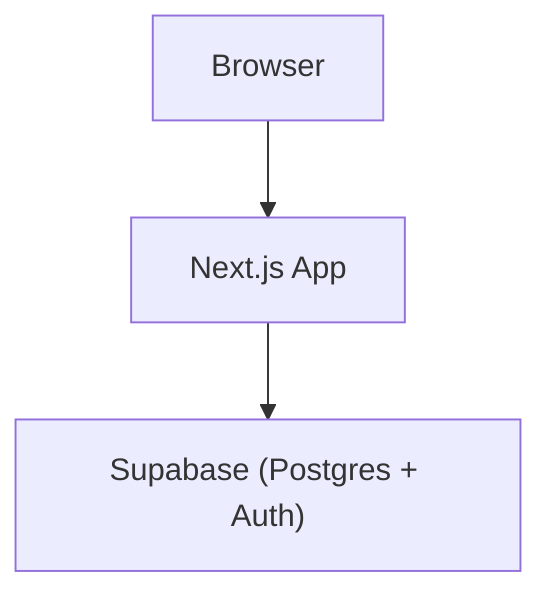

# ملخص حالة مشروع منصة التاريخ الإسلامي

> وثيقة تسليم مبنية على حالة المستودع الفعلية. آخر مزامنة: 1 أكتوبر 2026.

## 1. الحالة التنفيذية المختصرة

اكتملت في المستودع **المرحلة الأولى: تأسيس وعرض محتوى الخلافة الراشدة**:

- مخطط قاعدة البيانات وتوسعاته موجودة في ثلاث migrations.
- توجد حزم محتوى مراجعة للخلفاء الراشدين الأربعة.
- توجد سكربتات استيراد SQL مستقلة لأبي بكر وعمر وعثمان وعلي.
- الواجهة تعرض العصر، والخط الزمني، وسيرة الخليفة المحدد، وخريطة أحداث فترته.
- الخلفاء الأربعة لديهم إعداد عرض منظم داخل قارئ السيرة المشترك.
- السنوات تُخزن وتُعرض كهجرية مباشرة.

هذا الوصف يعني أن ملفات المرحلة الأولى مكتملة في Git. **لا يثبت Git وحده أن كل سكربت استيراد نُفذ على قاعدة Supabase الحية**؛ يجب تدقيق القاعدة قراءةً فقط قبل الاعتماد على أعداد الصفوف أو حالة تنفيذ أي importer.

## 2. المعمارية المعتمدة

المعمارية لها ثلاثة صناديق فقط:



- **Browser:** يعرض الواجهة التفاعلية والخريطة ويحتفظ بحالة الاختيار المؤقتة.
- **Next.js App:** يجلب البيانات من Supabase REST ويعرضها.
- **Supabase (Postgres + Auth):** يخزن البيانات، وهو المالك المخطط للمصادقة لاحقًا.

المصدر الرسمي للعقد المعماري هو `docs/architecture.md` و`AGENTS.md`. لا توجد API Routes أو Prisma أو خدمة خلفية أو قاعدة بيانات إضافية. فصل ملفات قارئ السيرة داخلي، وليس تغييرًا معماريًا.

## 3. التقنيات الحالية

- Next.js 16.3.5 باستخدام App Router.
- React 19.2.8 وTypeScript 5.
- Tailwind CSS 4.
- MapLibre GL JS 6.10 مع OpenStreetMap raster tiles بلا مفتاح مدفوع.
- خط Cairo من `@fontsource/cairo` مطبق على التطبيق كاملًا.
- واجهة عربية RTL عبر `<html lang="ar" dir="rtl">`.
- قراءة Supabase REST باستخدام:
  - `NEXT_PUBLIC_SUPABASE_URL`
  - `NEXT_PUBLIC_SUPABASE_ANON_KEY`

ملفات `.env*` متجاهلة بواسطة Git. لا تُحفظ المفاتيح أو الأسرار في المستودع أو هذه الوثيقة.

## 4. migrations ومخطط البيانات

ملفات migrations الموجودة:

1. `supabase/migrations/202609220001_initial_history_schema.sql`
   - أنشأت `eras`, `periods`, `people`, `places`, `events` وبيانات البداية.
2. `supabase/migrations/202609230001_expand_history_schema.sql`
   - أضافت slugs والمصادر والجداول الوسيطة و`map_layers`.
   - نقلت علاقة الشخص بالفترة إلى `period_people`.
   - استبدلت `events.event_year` بـ`start_year` و`end_year`.
3. `supabase/migrations/202609230002_add_content_fields_and_hijri_years.sql`
   - أضافت `sources.author` و`places.location_note`.
   - ثبتت قيم السنوات الهجرية المراجعة وأضفت comments توثيقية.

تُعامل هذه الملفات كتاريخ مطبق ولا يجوز تعديلها. أي تغيير schema لاحق يحتاج migration جديدة وموافقة صريحة.

الجداول الحالية وعددها أحد عشر:

- `eras`
- `periods`
- `people`
- `places`
- `events`
- `period_people`
- `event_people`
- `sources`
- `event_sources`
- `person_sources`
- `map_layers`

قيود مهمة:

- `people` لا يحتوي `period_id`; الربط يمر عبر `period_people`.
- الخلفاء مربوطون بفتراتهم باستخدام `role = 'caliph'` و`is_primary = true`.
- `places.coordinate_confidence` يقبل `confirmed` أو `approximate`.
- `sources.source_type` يقبل فقط `book`, `article`, `hadith`, `encyclopedia`, `other`.
- `sources.url` ليس عليه قيد `UNIQUE`; المستوردات تفحص التفرد المنطقي قبل إعادة الاستخدام.
- لا يوجد `sources.citation_note` ولا عمود دائم لحفظ aliases الخاصة بملفات JSON.
- `event_people` و`map_layers` موجودان لكن مستوردات الخلفاء الحالية لا تضيف بيانات إليهما.

## 5. سياسة السنوات

الأعمدة التالية تخزن السنة الهجرية AH مباشرة كعدد صحيح:

- `periods.start_year`
- `periods.end_year`
- `events.start_year`
- `events.end_year`

الفترات المعتمدة:

- أبو بكر الصديق: 11–13هـ.
- عمر بن الخطاب: 13–23هـ.
- عثمان بن عفان: 23–35هـ.
- علي بن أبي طالب: 35–40هـ.

الواجهة لا تنفذ تحويلًا ميلاديًا/هجريًا. سنة واحدة تظهر مثل `12هـ`، والمدى مثل `11–13هـ`، والقيمة الفارغة لا تعرض تاريخًا.

## 6. حزم محتوى الخلفاء الراشدين

### أبو بكر الصديق

- المصدر الآلي: `data/history/rashidun/abu-bakr/abu-bakr-content-pack.json`
- مرجع المراجعة البشرية: `data/history/rashidun/abu-bakr/abu-bakr-content-pack.md`
- المستورد: `supabase/imports/import_abu_bakr_content.sql`
- نطاق الحزمة: 5 أماكن، 6 أحداث، 9 مصادر.
- العلاقات التي يتحقق منها المستورد: 13 `event_sources` و4 `person_sources`.
- يحافظ المستورد على السنتين المعتمدتين في migration #3 لمعركة اليمامة وجمع القرآن: 12هـ.

### عمر بن الخطاب

- المصدر الآلي: `data/history/rashidun/umar/umar-ibn-al-khattab-content-pack.json`
- المستورد: `supabase/imports/import_umar_content.sql`
- نطاق الحزمة: 8 أماكن، 10 أحداث، 18 مصدرًا.
- العلاقات التي يتحقق منها المستورد: 21 `event_sources` و7 `person_sources`.

### عثمان بن عفان

- المصدر الآلي: `data/history/rashidun/uthman/uthman-ibn-affan-content-pack.json`
- المستورد: `supabase/imports/import_uthman_content.sql`
- نطاق الحزمة: 5 أماكن، 8 أحداث، 10 مصادر.
- العلاقات التي يتحقق منها المستورد: 15 `event_sources` و6 `person_sources`.
- يعيد استخدام `standardization-of-the-quran` ويحافظ على السنة المعتمدة 25هـ.

### علي بن أبي طالب

- المصدر الآلي المراجع: `data/history/rashidun/ali/ali-ibn-abi-talib-content-pack-verified.json`
- المستورد: `supabase/imports/import_ali_content.sql`
- نطاق الحزمة: 5 أماكن، 7 أحداث، 8 مصادر.
- العلاقات التي يتحقق منها المستورد: 14 `event_sources` و5 `person_sources`.
- يعيد استخدام المدينة والبصرة والكوفة وحدث `battle-of-the-camel` بسنة 36هـ.
- يضيف صفين والنهروان عند عدم وجود تعارض.

JSON هو مصدر الاستيراد الآلي. لا يجوز إعادة صياغة `briefBio` أو summaries أو significance أو تغيير الإحداثيات بصمت.

## 7. خصائص سكربتات الاستيراد

المستوردات الأربعة تتبع النمط نفسه:

- `BEGIN ... COMMIT` لمعاملة واحدة.
- idempotent ومحددة النطاق بمحتوى الخليفة.
- تحل الشخص بالـslug ثم الفترة من `period_people` حيث الخليفة أساسي.
- تعيد استخدام الأماكن والأحداث المعتمدة وتفحص تعارض slug/name قبل السجلات الجديدة.
- تعيد استخدام المصدر بالـURL بعد التحقق من أن URL المستهدف لا يحل إلى أكثر من صف.
- aliases داخل JSON مؤقتة داخل السكربت ولا تُحفظ كأعمدة.
- تستخدم `ON CONFLICT DO NOTHING` لعلاقات المصادر.
- تستخدم postconditions محددة للحزمة، ولا تفترض أعدادًا إجمالية ثابتة للقاعدة.
- لا تحذف بيانات غير مرتبطة، ولا تنفذ DDL، ولا تكتب `event_people` أو `map_layers`.

### حدود ما يمكن إثباته

يُثبت المستودع وجود الحزم والمستوردات ومحتواها، لكنه لا يحتوي سجل migrations/import execution حيًا. لذلك:

1. لا تقل إن importer نُفذ لمجرد وجود ملفه.
2. لا تستنتج أعداد الصفوف الحية من Git.
3. قبل استيراد أو تعديل لاحق، نفذ audit قراءة فقط على Supabase ثم اطلب موافقة صريحة قبل أي كتابة.

## 8. تدفق بيانات الواجهة

الصفحة الوحيدة هي `/`. ملف `components/HistoryPage.tsx` يجلب بالتوازي:

- العصر الأول من `eras`.
- الفترات مرتبة حسب `start_year`.
- الشخص الأساسي عبر `periods -> period_people (is_primary = true) -> people`.
- جميع الأماكن.
- جميع الأحداث مع `start_year` و`end_year`.

بعد الجلب:

- `selectedPeriodId` يبدأ بأول فترة.
- اختيار خليفة يغير الفترة والسيرة المعروضتين.
- الأحداث تُصفى client-side باستخدام `event.period_id === selectedPeriodId`.
- الأماكن تُصفى إلى الأماكن المشار إليها من أحداث الفترة المختارة.
- الاختيار لا يطلق REST request جديدًا.

لا تغيّر فلترة الخريطة أو popups عند العمل على قارئ السيرة أو أجزاء غير مرتبطة.

## 9. قارئ السيرة الحالي

البنية الحالية:

```text
components/biography/
  BiographyBook.tsx
  biography-config.ts
  biography-pagination.ts
```

المسؤوليات:

- `BiographyBook.tsx`: واجهة React/controller، الحالة، refs، دورة القياس، `ResizeObserver`، التنقل والرسم.
- `biography-config.ts`: إعدادات العرض فقط، وربط أسماء الأشخاص بالـslugs وحدود الأقسام.
- `biography-pagination.ts`: تقسيم النص والقياس والتحقق من ملاءمة الصفحات وإعادة البناء.

الإعداد موجود للخلفاء الأربعة:

- `abu-bakr-al-siddiq`: 8 حدود عرض.
- `umar-ibn-al-khattab`: 15 حدًا، وبعضها استمرار بلا عنوان جديد.
- `uthman-ibn-affan`: 17 حدًا، وبعضها استمرار بلا عنوان جديد.
- `ali-ibn-abi-talib`: 13 حدًا.

العناوين metadata للعرض فقط ولا تدخل في `brief_bio`. النص يُقسم بواسطة `slice` دون إعادة كتابة. عند فشل مطابقة الحدود، يعرض `sectionBiography` النص كاملًا بدل محتوى ناقص.

## 10. سلوك pagination

- مساحة القراءة ثابتة الارتفاع ومتجاوبة عبر CSS، ولا يتغير ارتفاع البطاقة بين الصفحات أو الخلفاء.
- لا يوجد scrollbar رأسي داخلي، و`overflow` مخفي عمدًا بعد تقسيم المحتوى إلى صفحات ملائمة.
- القياس يتم في حاوية مخفية بنفس CSS الخاص بالصفحة المرئية.
- ترتيب تفضيل الانقسام: فقرة، ثم جملة، ثم كلمة، ثم محرف لضمان التقدم.
- الخوارزمية تتحقق بعد التقسيم أن ضم body text يساوي `brief_bio` حرفًا بحرف وأن كل صفحة تلائم مساحة القياس.
- يوجد progress guard ورسائل خطأ واضحة بدل حلقة لا نهائية.
- `ResizeObserver` وإشارة جاهزية الخطوط يعيدان الحساب بأمان عند تغير المقاس.
- أزرار السابق/التالي لا تدور من النهاية إلى البداية، وتتعطل بلا `cursor-not-allowed`.
- اختيار خليفة آخر يعيد تركيب المكوّن ويبدأ من الصفحة الأولى.
- الحركة تحترم `prefers-reduced-motion`.
- عدد الصفحات ليس ثابتًا في الوثائق؛ يتحدد وقت التشغيل حسب عرض الشاشة والخط والقياس.

## 11. الخريطة والواجهة

ترتيب الصفحة من الأعلى إلى الأسفل:

1. رأس عصر الخلافة الراشدة.
2. خط زمني أفقي للخلفاء الأربعة.
3. قارئ سيرة الخليفة المحدد.
4. بطاقة خريطة بارتفاع 400px لأحداث فترته.

الخريطة:

- MapLibre GL JS مع OpenStreetMap raster tiles.
- العلامات مشتقة من الأماكن المرتبطة بأحداث الفترة المختارة.
- popup عربي RTL يعرض المكان والأحداث والوصف والسنة الهجرية.
- لا توجد طبقات GeoJSON مراجعة أو استخدام حالي لـ`map_layers`.

## 12. حالة التحقق عند إغلاق المرحلة

أوامر التحقق المعتمدة:

```text
npm run lint
npx tsc --noEmit
npm run build
```

عند آخر إغلاق للمرحلة نجحت الأوامر الثلاثة. يجب إعادة تشغيلها بعد أي تغيير لاحق؛ نجاح سابق لا يغني عن التحقق الحالي.

## 13. المكتمل وغير المنفذ

### المرحلة الأولى — مكتملة في المستودع

- تأسيس schema الخلافة الراشدة وتوسعات المحتوى.
- حزم ومستورِدات الخلفاء الأربعة.
- الصفحة العربية RTL وخط Cairo والثيم التراثي.
- timeline واختيار الخليفة.
- فلترة الخريطة والأحداث حسب الفترة.
- قارئ سيرة مشترك منظم للخلفاء الأربعة.
- refactor قارئ السيرة إلى config وpagination وReact UI منفصلة.

### غير منفذ حتى الآن

- تسجيل الدخول أو واجهة Supabase Auth.
- ملف مستخدم أو منطقة شخصية.
- حفظ تقدم القراءة أو العناصر المحفوظة.
- لوحة إدارة أو workflow تحرير داخل التطبيق.
- routes/pages إضافية.
- بيانات `event_people` أو `map_layers`.
- عصور تاريخية إضافية بعد الخلافة الراشدة.

## 14. المراحل التالية

### Phase 2 — التالية وليست منفذة

تنظيف/إعادة تصميم UI/UX وبنية frontend. يجب تحديد نطاقها واعتماده قبل البدء، مع الحفاظ على السلوك والبيانات الحالية ما لم يطلب خلاف ذلك.

### لاحقًا

1. Auth.
2. منطقة المستخدم/profile.
3. Admin dashboard وتدفق تحرير ومراجعة المحتوى.
4. عصور ومحتوى تاريخي إضافي.

لا تصف أي بند من هذه البنود بأنه مطبق قبل وجود كوده واعتماده.

## 15. قواعد العمل للمراحل القادمة

- اقرأ `AGENTS.md` و`docs/architecture.md` قبل أي تغيير هيكلي.
- لا تعدل migrations الثلاث الموجودة.
- لا تنفذ importer أو DDL دون موافقة صريحة.
- لا تغيّر النص التاريخي المراجع أو ترتيبه أو الإحداثيات بصمت.
- حافظ على السنوات الهجرية المخزنة مباشرة.
- حافظ على RTL وخط Cairo وسلامة النص العربي.
- لا تضف خدمة أو قاعدة أو backend process دون تحديث عقد المعمارية وإبلاغ المستخدم أولًا.
- افصل دائمًا بين ما يوجد في Git وما نُفذ فعليًا على Supabase وما يزال خطة مستقبلية.
